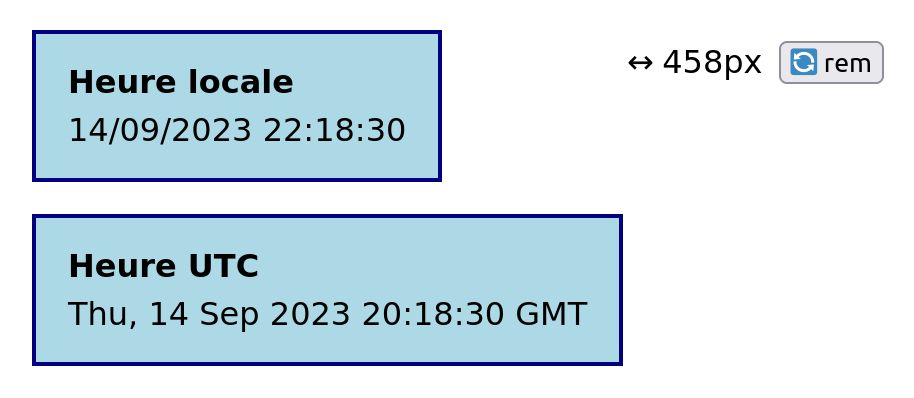

# TP Web Components

Le terme _Web Component_ regroupe trois technologies natives :

<ol>
  <li>Les <em>Custom Elements</em></li>
  <li>Le <em>Shadow DOM</em></li>
  <li>Les éléments HTML <code>&lt;template&gt;</code> et <code>&lt;slot&gt;</code> 
</ol>

Ces trois concepts seront introduits successivements par les trois exercices.

## 1. Les _Custom Elements_

Les _Custom Elements_ permettent de créer des éléments HTML sur mesure et de définir leur contenu et leur comportement.

- Créez un fichier `index.html` avec une structure basique.
- Créez un fichier `src/current-time.js` et importez-le dans la balise `<head>` du fichier HTML. Utilisez l'attribut `defer` pour ne pas bloquer le parsing du fichier HTML.
- Ouvrez votre application dans le navigateur grâce à l'extension _Live Server_ de _VSCode_ et vérifiez le bon lien entre les deux fichiers.

### Le composant `<current-time>`

Nous allons créer un composant affichant la date actuelle :

- Dans le fichier JavaScript, déclarez une classe `CurrentTime` qui étend la classe native `HTMLElement`.
- À la suite de la classe, grâce à la fonction `customElements.define("nom-du-tag", NomDeLaClasse)`, associez votre classe au tag `current-time`.
- Utilisez le tag `current-time` dans votre fichier HTML.
- Déclarez la méthode `connectedCallback` dans votre classe. Au sein de cette méthode, utilisez `this.innerHTML` pour ajouter du contenu à votre tag.

Le contenu doit s'afficher dans votre page.

### Affichage de l'heure

- Remplacez votre contenu de test par le vrai contenu, soit une div de classe `currentTime`, contenant :
  - un élément `
` de classe `currentTime__title` et contenant la chaîne `Heure locale` ;
  - un élément `<time>` de classe `currentTime__time`, vide.
- À la suite de cette opération, gardez une référence vers l'élément `<time>` dans la classe, nous en aurons besoin. Trouvez l'élément grâce à `this.querySelector` et stockez le dans `this.$time`.
- Insérez la date dans l'élément `<time>`. Elle peut être obtenue grâce à l'expression `new Date().toLocaleString()`.
- La date doit désormais s'afficher. Ajoutez quelques styles grâce à un fichier CSS inclus dans votre fichier principal. C'est important, le style.

### Mise à jour automatique

On souhaite que la date se mette à jour à chaque seconde.

- Trouvez un moyen pour mettre à jour le contenu de `<time>` à chaque seconde (sans rafraîchir l'intégralité du contenu !)
- En utilisant la fonction `disconnectedCallback`, assurez-vous que la fonction de mise à jour ne sera plus appelée "dans le vide" après la disparition du composant. Pour le vérifier, vous pouvez supprimer le composant directement dans l'inspecteur et observer les effets (à l'aide de `console.log` par exemple).

### Paramètre UTC

Notre composant va désormais être capable d'accueillir un paramètre `format`. Si ce format vaut `utc`, on souhaite afficher l'heure UTC. Pour toute autre valeur, y compris l'absence de valeur, on reste sur le comportement initial (heure locale).

- Dans votre HTML, ajoutez un deuxième appel au composant en passant cette fois-ci l'attribut `format="utc"`. Un deuxième composant (pour l'instant identique) apparaît.
- Déclarez les attributs pris en compte par votre composant grâce à la méthode `static get observedAttributes()`, qui doit retourner un tableau contenant le nom des attributs concernés.
- Grâce à la méthode `attributeChangedCallback(name, oldVal, newVal)`, lorsque vous détectez un changement sur l'attribut `format`, stockez sa valeur dans `this.format`.
- Dans votre fonction de rendu, utilisez `this.format` pour adapter :
  - le titre du composant (`Heure UTC` ou `Heure locale`)
  - le contenu de l'élément `<time>` (`new Date().toUTCString()` ou `new Date().toLocaleString()`)

Les deux composants ont désormais un comportement différent !

### Le soucis du détail

Que se passe t-il lorsque vous inspectez le DOM et ajoutez / retirez manuellement l'attribut `format="utc"` ? Si votre composant ne se met pas à jour, il vous manque encore un tout petit peu de bricolage...

## 2. Le _Shadow DOM_

Le _Shadow DOM_ permet d'isoler le contenu d'un composant du reste de la page. **Cela n'est pas toujours nécessaire**, mais peut être pratique dans certains cas.

### Le composant `<screen-size>`

Le composant `<screen-size>` se comporte comme suit :

- il est flottant en haut à droite de l'écran
- il indique en permanence la largeur du viewport
- la largeur est indiquée en `px` ou en `rem`
- un bouton permet d'alterner entre les deux unités
- le composant accepte un attribut `unit` pour paramétrer son unité initiale

En voici un aperçu :

Construisez ce composant en vous inspirant du composant `<current-time>`, mais cette fois-ci en utilisant le _Shadow DOM_ (soit en deux temps, soit directement).

### Spécificités du _Shadow DOM_

- Sa classe déclare une méthode appelée `constructor()` (cette méthode est aussi disponible sans _shadow DOM_, mais moins utile).
- La méthode `constructor()` commence toujours par appeler le constructeur de la classe parente avec `super()`.
- Toujours dans le constructeur, le _Shadow DOM_ est crée grâce à l'instruction `this.attachShadow({ mode: "open" });`
- Le code d'initialisation qui était auparavant dans la méthode `connectedCallback` peut être ramené dans le constructeur.
- Les `querySelector` ne s'éxécutent plus sur `this` mais sur `this.shadowRoot`.

### _Shadow DOM_ et styles

Vous ne pouvez pas appliquer des styles depuis votre fichier global. Le _shadow DOM_ encapsule ses propres styles.

Vous devez donc déclarer les styles directement dans le template, avec une balise `<style>` (par exemple injectée via `innerHTML`).

En contrepartie, les styles que vous déclarez dans un composant utilisant le _shadow DOM_ ne peuvent pas "fuiter". Il est donc possible de se passer de classes et de cibler les éléments HTML sans s'inquiéter de potentiels conflits.

### _Shadow DOM_ et scripts

- Dans la console, cherchez les boutons présents sur la page : `document.querySelector("button")`. Qu'observez-vous ?
- Cherchez à présent `document.querySelector("screen-size").shadowRoot.querySelector("button")` et comparez le résultat.
